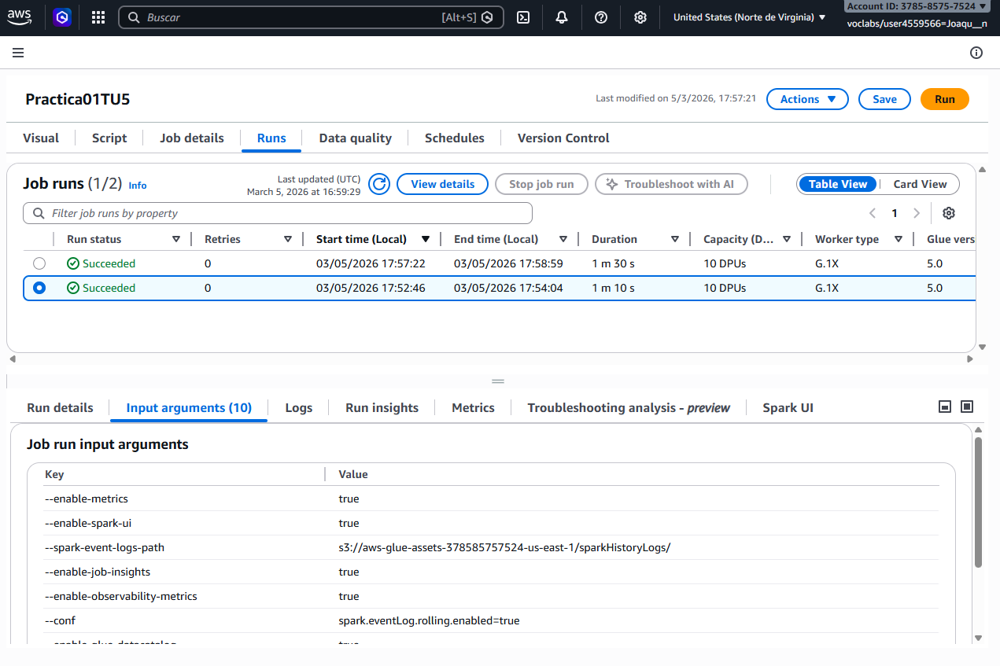
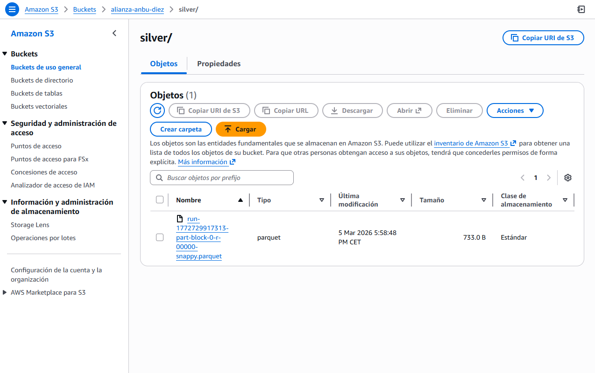

#  Práctica 1
>La práctica 1 consiste en usar aws para filtrar un csv.

## Evidencias Cloud

Sale Succeeded.

## Análisis de Optimización

Antes pesaba 136KB .

## Reflexión

>El enfoque Serverless ofrece varias ventajas frente a procesar un archivo manualmente en tu PC. Principalmente, permite automatizar tareas, liberando al usuario de ejecutarlas manualmente, y escalar automáticamente según el tamaño o la cantidad de datos sin preocuparse por los recursos de tu ordenador. Además, garantiza mayor disponibilidad y rapidez, ya que el procesamiento se realiza en la nube, y puede integrarse fácilmente con otros servicios, reduciendo errores humanos y mejorando la eficiencia general.

