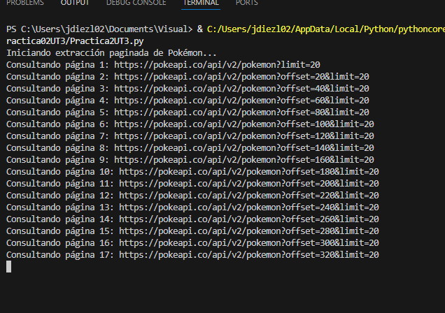
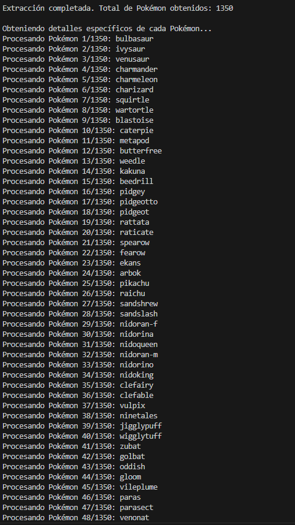
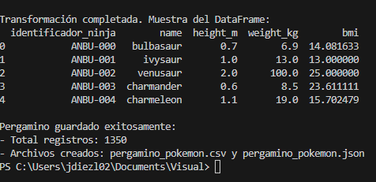

#  Práctica 2
>La práctica 2 consiste en sacar inforacion de un csv.
## Paso 1

Importamos todas las librerias necesarias y ponemos la url de la api.
```
import requests
import time
import pandas as pd

# Configuración inicial
url = "https://pokeapi.co/api/v2/pokemon?limit=20"
todos_los_pokemon = []
```

## Paso 2

Usamos un while y el next que te da la pagina y vamos sacando los datos.
```
print("Iniciando extracción paginada de Pokémon...")
contador_paginas = 0

while url:
    contador_paginas += 1
    print(f"Consultando página {contador_paginas}: {url}")
    
    # Realizar la petición a la API
    response = requests.get(url)
    
    if response.status_code == 200:
        data = response.json()
        
        # Añadir los resultados a la lista principal
        todos_los_pokemon.extend(data['results'])
        
        # Actualizar URL para la siguiente página
        url = data.get('next')
        
        # Pausa para no saturar la API
        time.sleep(0.5)
    else:
        print(f"Error en la petición: {response.status_code}")
        break

print(f"\nExtracción completada. Total de Pokémon obtenidos: {len(todos_los_pokemon)}")
```



## Paso 3

Sacamos los que queremos de cada pokemon.
```
print("\nObteniendo detalles específicos de cada Pokémon...")
pokemon_detallados = []

for i, pokemon in enumerate(todos_los_pokemon, 1):
    print(f"Procesando Pokémon {i}/{len(todos_los_pokemon)}: {pokemon['name']}")
    
    try:
        # Obtener datos detallados de cada Pokémon
        detalle_response = requests.get(pokemon['url'])
        detalle_data = detalle_response.json()
        
        # Extraer solo los campos requeridos
        pokemon_info = {
            'name': detalle_data['name'],
            'height': detalle_data['height'],  # en decímetros
            'weight': detalle_data['weight'],  # en hectogramos
            'base_experience': detalle_data['base_experience']
        }
        
        pokemon_detallados.append(pokemon_info)
        time.sleep(0.2)  # Pausa corta entre peticiones
        
    except Exception as e:
        print(f"Error obteniendo detalles de {pokemon['name']}: {e}")
```



## Paso 4

Con esto cálculamos el BMI.
```
# Crear DataFrame
df = pd.DataFrame(pokemon_detallados)

# Transformación de unidades y cálculo del BMI
df['height_m'] = df['height'] / 10  # Convertir decímetros a metros
df['weight_kg'] = df['weight'] / 10  # Convertir hectogramos a kilogramos
df['bmi'] = df['weight_kg'] / (df['height_m'] ** 2)

# Formatear columnas
df['identificador_ninja'] = df.index.map(lambda x: f"ANBU-{x:03d}")

print("\nTransformación completada. Muestra del DataFrame:")
print(df[['identificador_ninja', 'name', 'height_m', 'weight_kg', 'bmi']].head())
```

## Paso 5

Ahora guardamos los diferentes formatos.
```
# Guardar en diferentes formatos
df.to_csv('pergamino_pokemon.csv', index=False)
df.to_json('pergamino_pokemon.json', orient='records', indent=2)

print(f"\nPergamino guardado exitosamente:")
print(f"- Total registros: {len(df)}")
print(f"- Archivos creados: pergamino_pokemon.csv y pergamino_pokemon.json")
```

## Resultados finales



## Preguntas de Reflexión

>1.Es mejor ya que te viene ya todo echo sin tener que calcular ni que te salgan duplicados.
>2.Que ya lo dejamos guardado y no ahi que procesarlo despues.
>3.Al tener un limite de 1000 se traeria antes todo los pokemons.

## Conclusión

>Que en poco tiempo puedes obtener informacion valiosa sin tener que copiar o descargar archivos.

