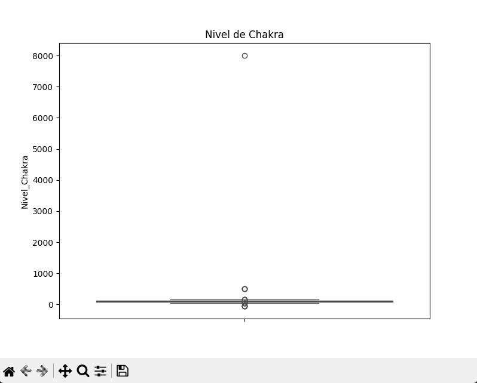

#  Práctica 2
>La práctica 2 consiste en identificar outliers en un dataset usando Boxplots y Z-Score.
## Paso 1

Importamos todas las librerias necesarias.
```
import pandas as pd
import seaborn as sns
import matplotlib.pyplot as plt
from scipy.stats import zscore
```

## Paso 2

Vemos outlairs en el box plot de nivel de chakra.
```
plt.figure(figsize=(8, 6))
sns.boxplot(y=datos_ninja["Nivel_Chakra"], color='orange')
plt.title('Nivel de Chakra')
plt.show()
```


## Paso 3

Vemos quien tiene la Z mayor a 3.
```
datos_ninja = pd.read_csv("misiones_limpias.csv")

print(datos_ninja.head())

perfil = datos_ninja['Nivel_Chakra'].describe()
print("\nPerfil de Nivel_Chakra:\n", perfil)

media_chakra = perfil['mean']
desv_chakra = perfil['std']
max_chakra = perfil['max']

datos_ninja["Z"] = (datos_ninja["Nivel_Chakra"] - media_chakra)/desv_chakra
datos_ninja_z = datos_ninja[datos_ninja["Z"] >= 3]

print(datos_ninja_z[["ID","Z"]])
```
```
Name: Nivel_Chakra, dtype: float64
      ID          Z
698  699  31.346493
```

## Paso 4

Busca ninjas con Chakra Negativo.
```
datos_ninja_f = datos_ninja[datos_ninja["Nivel_Chakra"] < 0]

print(datos_ninja_f[["ID", "Nivel_Chakra"]])
```
```
      ID  Nivel_Chakra
182  183         -50.0
267  268         -50.0
557  558         -50.0
807  808         -50.0
898  899         -50.0
```

Busca ninjas de la aldea “Desconocida”.
```
datos_ninja_a = datos_ninja[(datos_ninja["Aldea"] != "Konoha") & (datos_ninja["Aldea"] != "Suna") & (datos_ninja["Aldea"] != "Iwa") & (datos_ninja["Aldea"] != "Kiri") & (datos_ninja["Aldea"] != "Suna") & (datos_ninja["Aldea"] != "Iwa") & (datos_ninja["Aldea"] != "Kumo")]

print(datos_ninja_a[["ID","Aldea"]])
```
```
      ID        Aldea
698  699  Desconocida
```

No ahi ningun super ninja.
```
datos_ninja_superninja = datos_ninja[(datos_ninja["Z"] >= 2) & (datos_ninja["Z"] <= 3)]

print(datos_ninja_superninja[["ID","Z"]])
```

## Paso 5

Si coinciden.
```
ninjaTraidor = datos_ninja[(datos_ninja["ID"] == 699)]

print(datos_ninja_a[["ID","Aldea","Rango","Nivel_Chakra","Misiones_Falladas"]])
```
```
      ID        Aldea   Rango  Nivel_Chakra  Misiones_Falladas
698  699  Desconocida  Chunin        8000.0                  0
```

## Preguntas de reflexión

>1. Porque tener chakra negativo es imposible es mas facil creer que ha fallado el sensor de chakra.
>2. Sube ya que ahi chakra negativo.
>3. No ya que pueden ser anomalias

