#  Práctica 2

# Modelo de Datos
## 1 Creación de la Tabla Principal

>Creamos la tabla
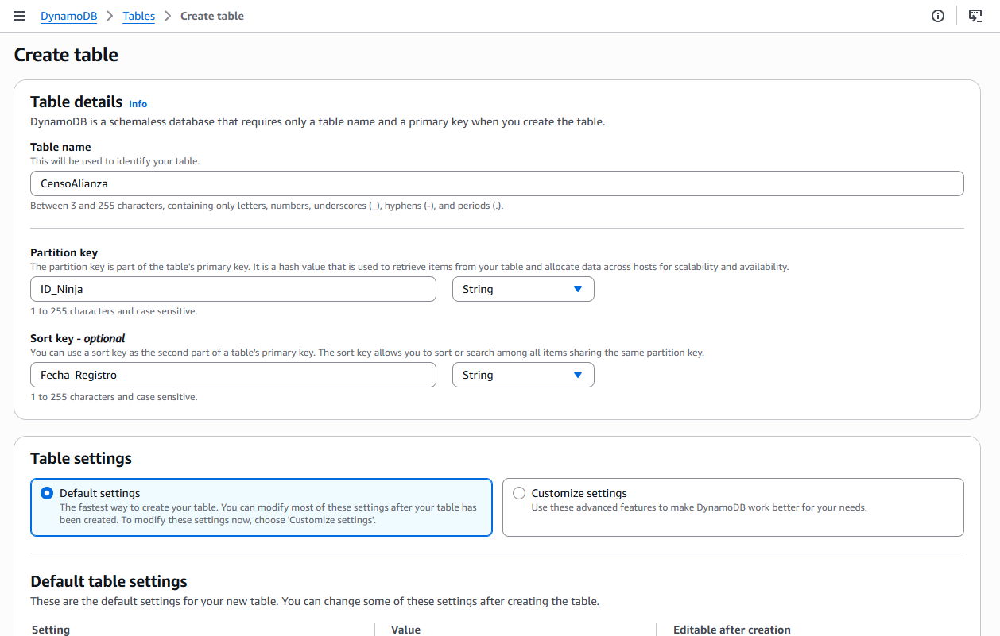

## 2 Ingesta de Dados Críticos

>Nos vamos a createitem y cremos un item
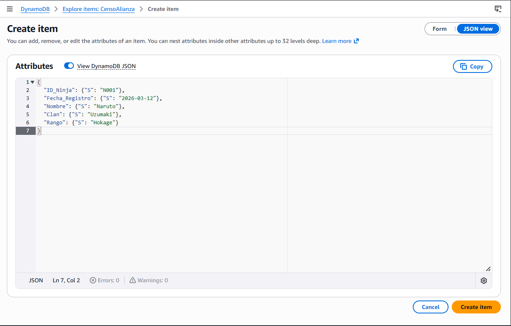 

>Creamos 5 diferentes
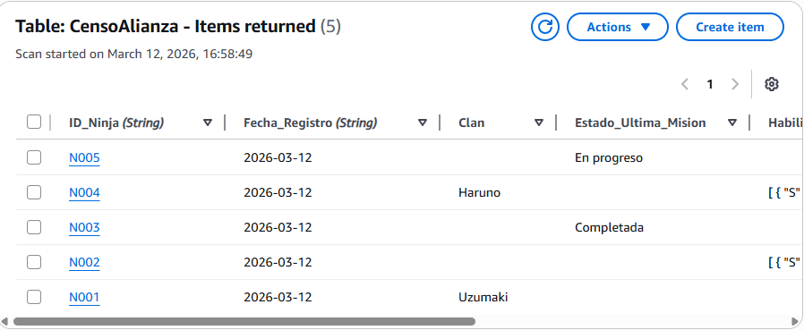

## 3 Simulación de Búsqueda ANBU

>Query buscando por un ID_Ninja específico
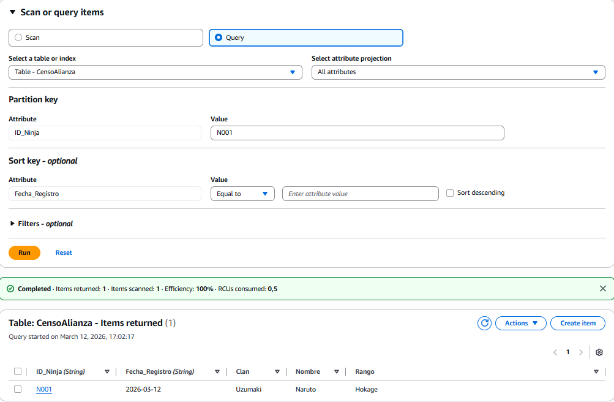

>Scan buscando a todos los ninjas de un “Clan” específico
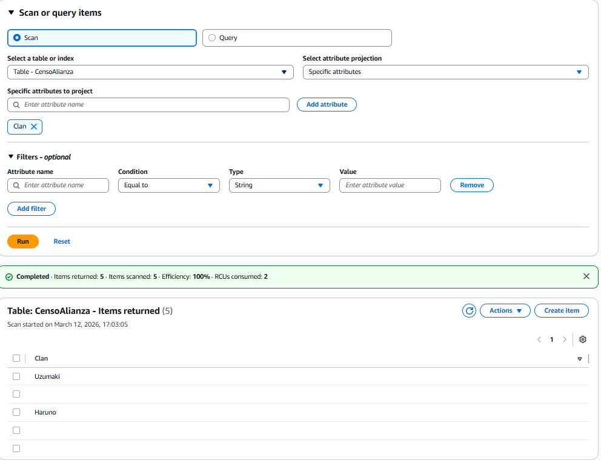

## 4 Actualización Dinámica

>Modifico un registro existente añadiendo un atributo nuevo llamado Nivel_Amenaza
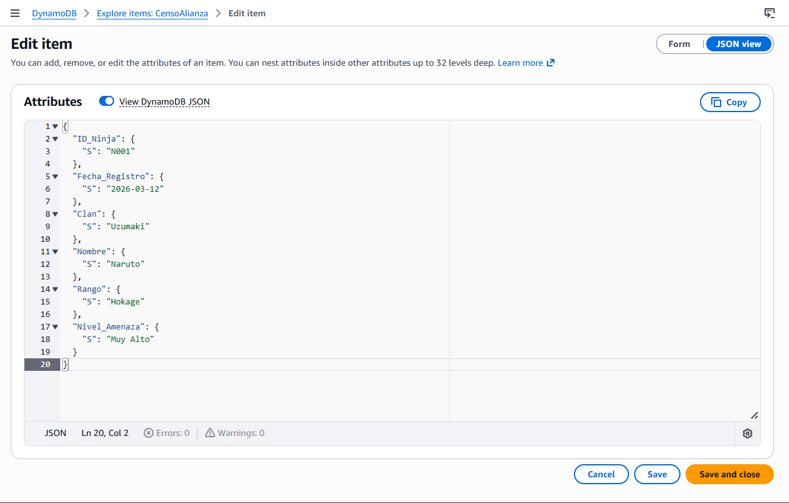

# Análisis Técnico
>Partition Key: Es el atributo que organiza los datos. Si buscas mucho por “Aldea”, conviene usar Aldea como Partition Key para consultas rápidas.

>Global Secondary Index (GSI): Es un índice adicional que permite buscar por otros atributos distintos de la clave principal, sin modificar la tabla.

# Captura
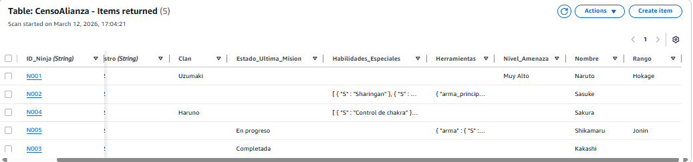

# Adicional
>Creamos una copia de uno nuestro y lo exportamos al gold con los filtros aplicados en csv.
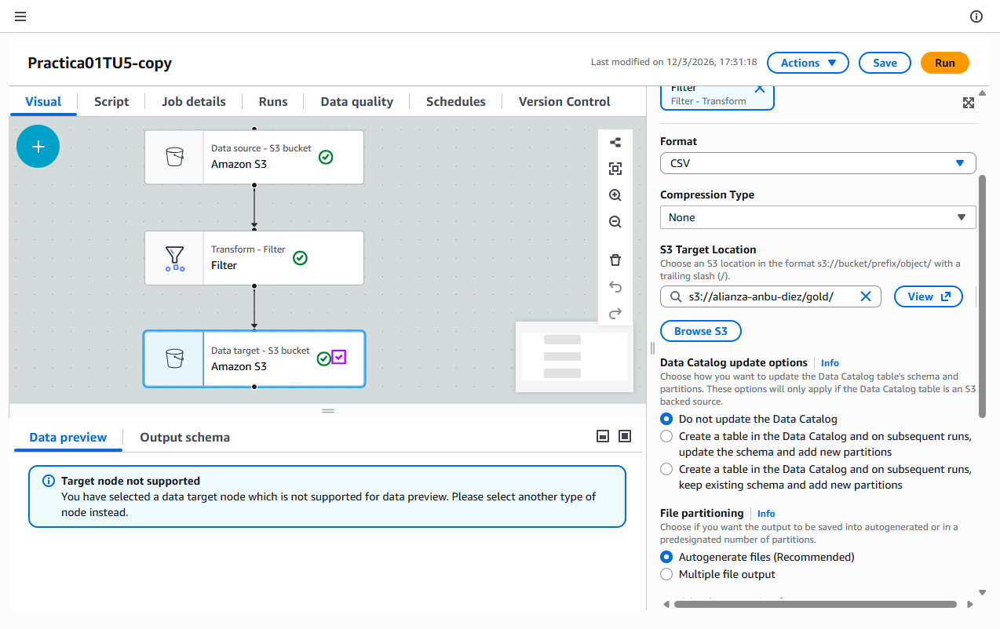

>Importamos en el csv filtrado.
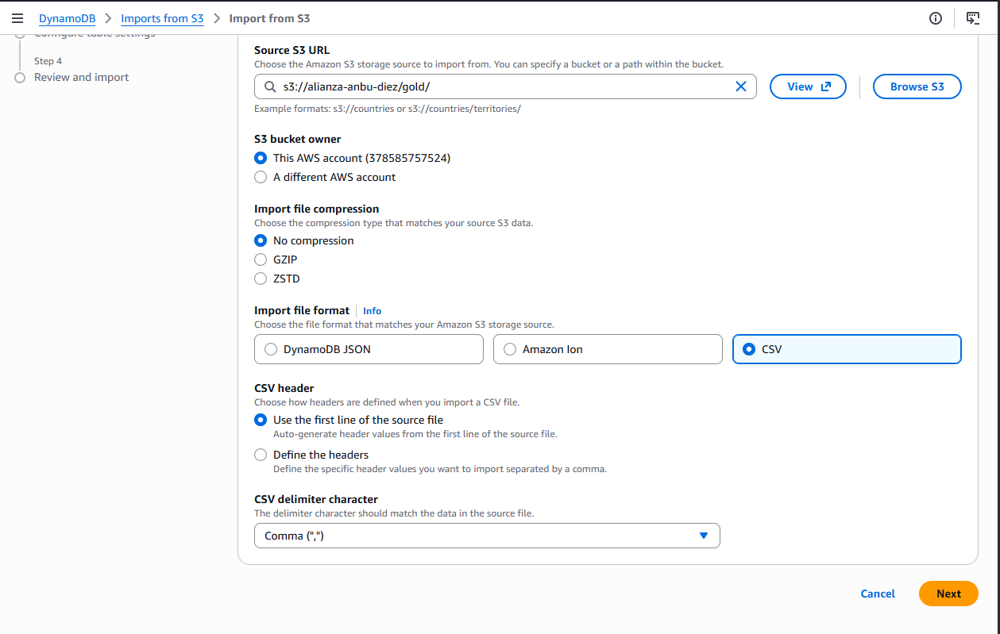
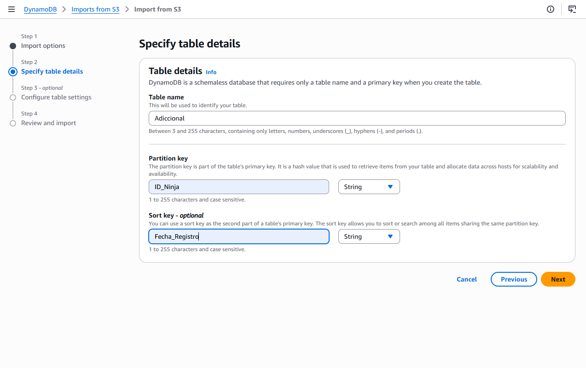
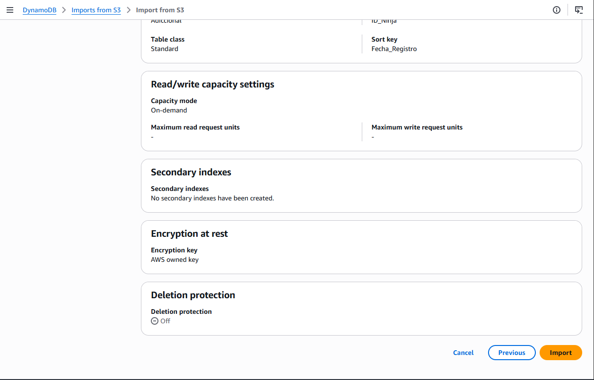

>Y ya lo hemos creado pero da error.
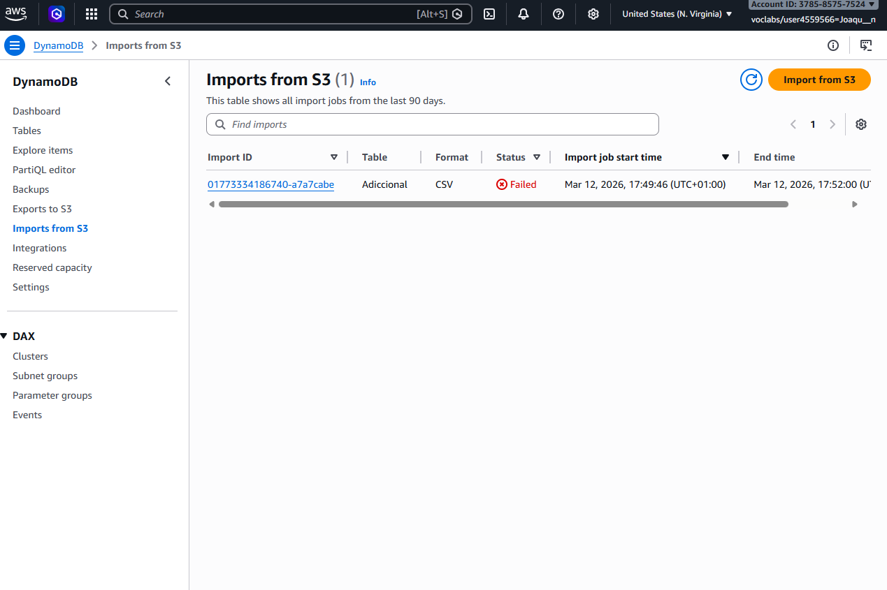