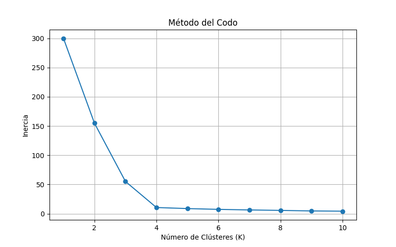
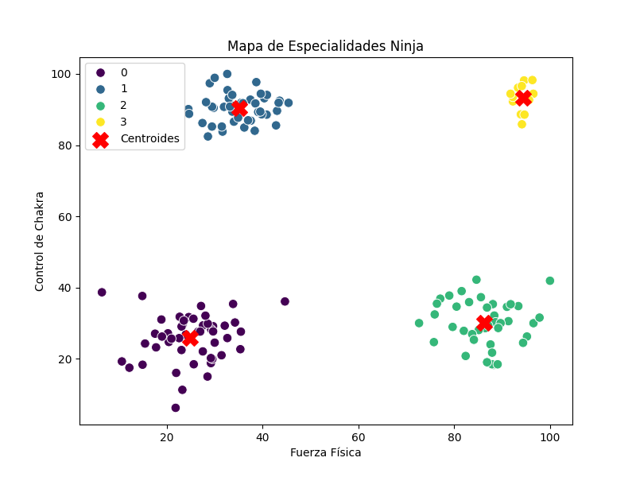

#  Práctica 3
>La práctica 3 consiste en crear gráficos de dispersión de los poderes de chakra.

## Paso 1

Importamos todas las librerias necesarias.
```
import pandas as pd
import numpy as np
import matplotlib.pyplot as plt
import seaborn as sns

from sklearn.cluster import KMeans
from sklearn.preprocessing import StandardScaler
```

## Paso 2

cargamos el dataset y limpiamos.
```
df = pd.read_csv("aptitudes_ninja.csv")

print("\nPrimeras filas del dataset:")
print(df.head())

print("\nInformación del dataset:")
print(df.info())

print("\nValores nulos por columna:")
print(df.isnull().sum())

print("\nValores negativos detectados:")
print("Fuerza negativa:", (df["fuerza_fisica"] < 0).sum())
print("Chakra negativo:", (df["control_chakra"] < 0).sum())

df = df[(df["fuerza_fisica"] >= 0) & (df["control_chakra"] >= 0)]
df = df.dropna()

print("\nDataset limpio:", df.shape)
```

## Paso 3

Elegimos las variables y hacemos el grafico.
```
X = df[["fuerza_fisica", "control_chakra"]]

scaler = StandardScaler()
X_scaled = scaler.fit_transform(X)

inercias = []

for k in range(1, 11):
    modelo = KMeans(n_clusters=k, random_state=42, n_init=10)
    modelo.fit(X_scaled)
    inercias.append(modelo.inertia_)

plt.figure(figsize=(8,5))
plt.plot(range(1,11), inercias, marker='o')
plt.xlabel("Número de Clústeres (K)")
plt.ylabel("Inercia")
plt.title("Método del Codo")
plt.grid()
plt.show()
```

## Paso 4

probamos el k optimo y mostramos el grafico.
```
k_optimo = 4

kmeans = KMeans(n_clusters=k_optimo, random_state=42, n_init=10)
kmeans.fit(X_scaled)

# Asignar clúster a cada ninja
df["cluster"] = kmeans.labels_

# Obtener centroides
centroides = kmeans.cluster_centers_

# Convertir centroides a escala original
centroides_original = scaler.inverse_transform(centroides)

print("\nCentroides (escala original):")
for i, centro in enumerate(centroides_original):
    print(f"Cluster {i}: Fuerza={centro[0]:.2f}, Chakra={centro[1]:.2f}")

plt.figure(figsize=(8,6))

sns.scatterplot(
    x=df["fuerza_fisica"],
    y=df["control_chakra"],
    hue=df["cluster"],
    palette="viridis",
    s=70
)

plt.scatter(
    centroides_original[:, 0],
    centroides_original[:, 1],
    c='red',
    marker='X',
    s=200,
    label='Centroides'
)

plt.xlabel("Fuerza Física")
plt.ylabel("Control de Chakra")
plt.title("Mapa de Especialidades Ninja")
plt.legend()
plt.show()

df.to_csv("ninjas_clasificados.csv", index=False)
print("\nArchivo guardado: ninjas_clasificados.csv")
```



## Paso 5

Aqui lo interpretamos
´´´
for i, centro in enumerate(centroides_original):
    fuerza, chakra = centro

    if fuerza > chakra + 15:
        tipo = "Fuerza de Choque"
    elif chakra > fuerza + 15:
        tipo = "Especialistas en Chakra / Médicos"
    else:
        tipo = "Ninjas Balanceados / Exploradores"

    print(f"Cluster {i} → {tipo}")
´´´



## Conclusion

>La k buena es 4 y los 4 grupos son que solo tienen buen fisico,solo tiene buen control de chakra,no tiene ni buen control de chakra ni fuerza fisica y que tiene buena fuerza fisica y buen control de chakra.

