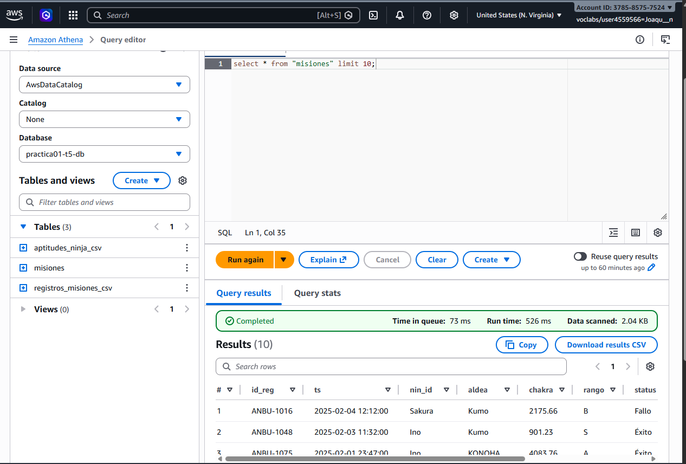
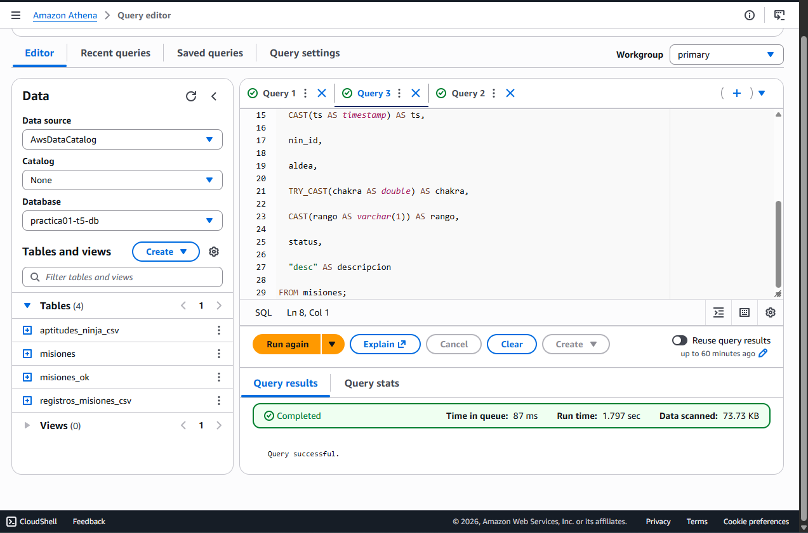
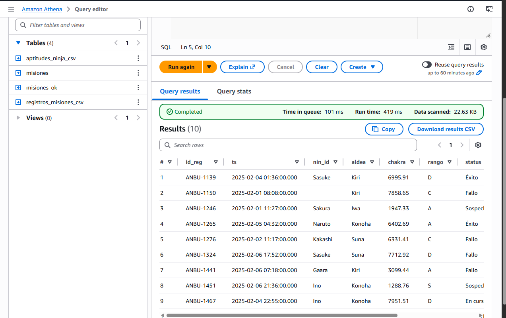
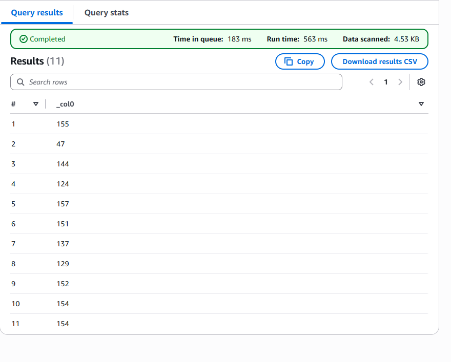
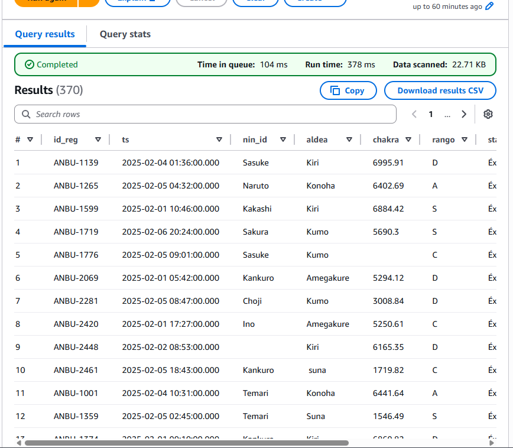
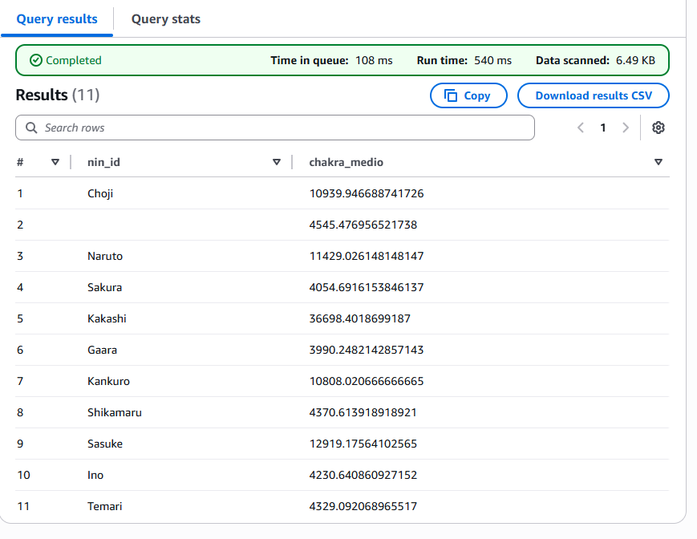
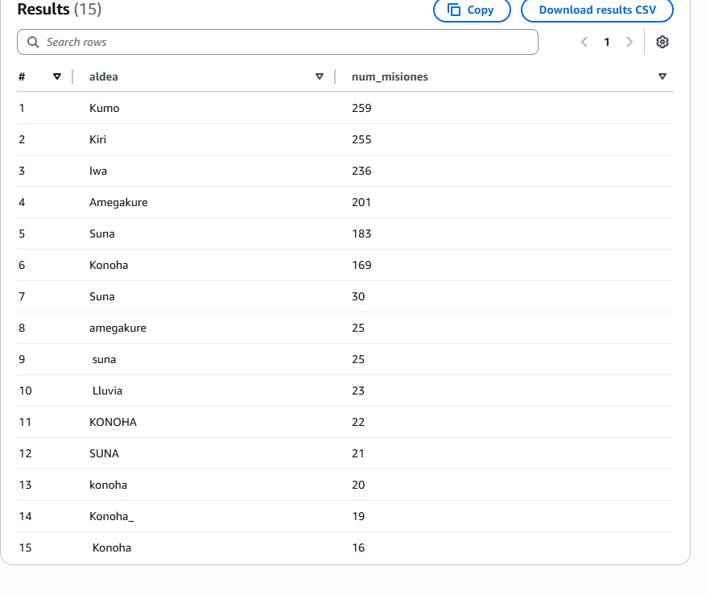
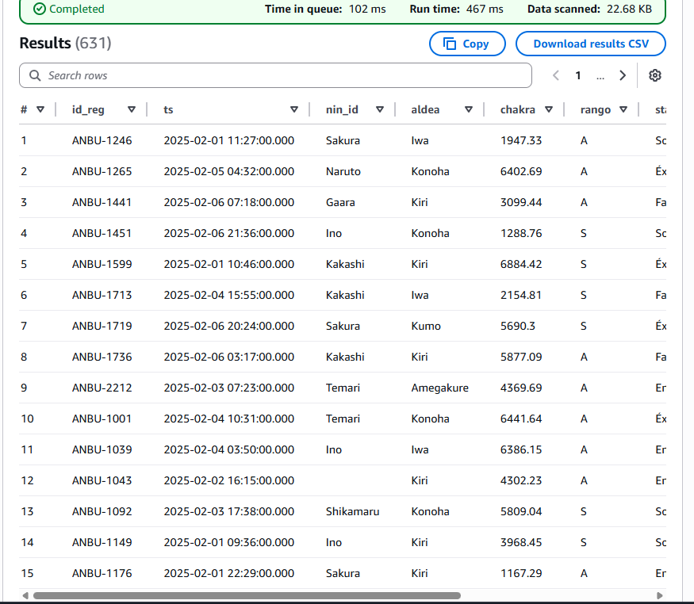
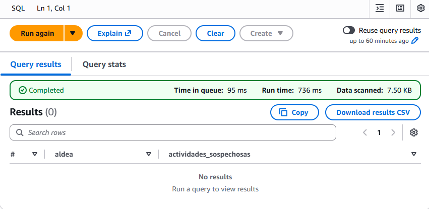

#  Práctica 3

# 1. Consulta Nº1

>Nos trae todo de la tabala misiones.
```
SELECT *

FROM "misiones"

limit 10;
```


# 2. Consulta Nº2

>Creamos la tabala misiones_ok con los datos de misiones.
```
CREATE TABLE misiones_ok

WITH (

  format = 'PARQUET',

  external_location = 's3://anbu-data-lake-diezlopez-misiones/gold/'

) AS

SELECT

  id_reg,

  CAST(ts AS timestamp) AS ts,

  nin_id,

  aldea,

  TRY_CAST(chakra AS double) AS chakra,

  CAST(rango AS varchar(1)) AS rango,

  status,

  "desc" AS descripcion

FROM misiones;
```


# 3. Consulta Nº3

>Nos trae todo de la tabala misiones_ok.
```
SELECT *

FROM "misiones_ok"

limit 10;
```



# Consultas a realizar.

## 1. Número de misiones realizadas por cada ninja
```
select count(id_reg) from misiones_ok group by nin_id;
```

## 2. Misiones completadas con éxito
```
select * from misiones_ok where status = 'Éxito';
```

## 3. Chakra medio usado por cada ninja
```
select nin_id,avg(cast(chakra as DOUBLE)) as chakra_medio from misiones_ok group by nin_id;
```

## 4. Número de misiones por aldea
```
select aldea,count(*) as num_misiones from misiones_ok group by aldea order by num_misiones desc;
```

## 5. Misiones de rango alto (A o S)
```
select * from misiones_ok where rango in ('A', 'S');
```

## 6. Realiza un GROUP BY para encontrar qué aldea ha realizado más actividades sospechosas en el último mes
```
select aldea, 
       count(*) as actividades_sospechosas
from misiones_ok
where lower(descripcion) like '%sospech%'
  and cast(ts as timestamp) >= current_timestamp - interval '1' month
group by aldea
order by actividades_sospechosas desc;
```
